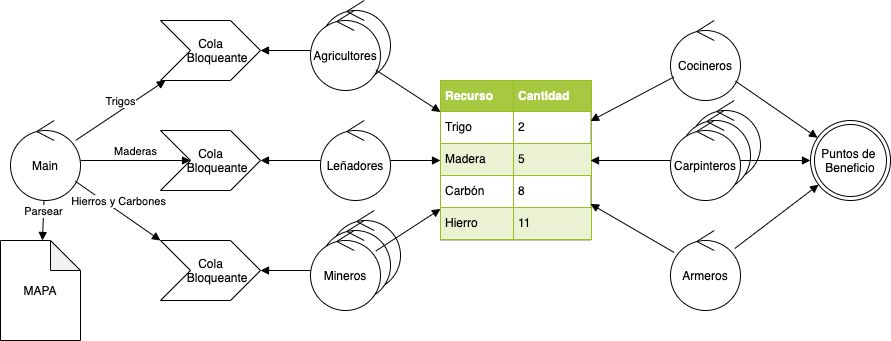

# 
 TP2 

# 
 Recolectores y Productores 

### 
 BOTTA, Guido Tomas 

### 
 Padron: 102103 

### 
 Enlace a Github: https://github.com/guidobotta/tp2-taller 

# Introducción

&nbsp;&nbsp;&nbsp;&nbsp; 

# Aclaraciones

&nbsp;&nbsp;&nbsp;&nbsp; 

# Desarrollo

## Problema de Recolectores y Productores

&nbsp;&nbsp;&nbsp;&nbsp; Se cuenta con un conjunto de trabajadores, que dividen en recolectores, que trabajan la materia prima, y productores, que transforman la materia prima en puntos de beneficio. Ambos tipos de trabajadores serán modelados como threads. Además, se cuenta con un conjunto de recursos con los que trabajarán estos trabajadores.

&nbsp;&nbsp;&nbsp;&nbsp; Además de los recursos y trabajadores, se cuenta con estructuras de almacenamiento que son las colas bloqueantes y un inventario (también bloqueante). Cada tipo de recolector tendrá una cola bloqueante a la que acceder. En cambio, habrá un único inventario compartido para todos los tipos de trabajadores.

&nbsp;&nbsp;&nbsp;&nbsp; Los recursos se dividen en cuatro tipos: **Trigo**, **Madera**, **Carbón** y **Hierro**.

&nbsp;&nbsp;&nbsp;&nbsp; Los recolectores se dividen en tres tipos:

1. **Agricultores**: recolectan trigo, proveniente de la respectiva cola bloqueante, y lo envían al inventario.
2. **Leñadores**: recolectan madera, proveniente de la respectiva cola bloqueante, y lo envían al inventario.
3. **Mineros**: recolectan hierro y carbón, proveniente de la respectiva cola bloqueante, y lo envían al inventario.

&nbsp;&nbsp;&nbsp;&nbsp; Los trabajadores se dividen en tres tipos:

1. **Cocineros**: convierten 2 unidades de trigo más 1 de carbón, obtenidas del inventario, en 5 puntos de beneficio.
2. **Carpinteros**: convierten 3 unidades de maderas más 1 de hierro, obtenidas del inventario, en 2 puntos de beneficio.
3. **Armeros**: convierten 2 unidades de carbón más 2 de hierro, obtenidas del inventario, en 3 puntos de beneficio.

&nbsp;&nbsp;&nbsp;&nbsp; Los trabajadores, al recibir los materiales que necesitan, dormirán para simular trabajo. Por parte de los recolectores, dormirán 50ms. Mientras que los productores dormirán 60ms.

&nbsp;&nbsp;&nbsp;&nbsp; Para la ejecución del programa, se requieren dos archivos:

- Uno con la información de la cantidad de trabajadores, con el siguiente formato:

~~~
Agricultores=x
Leniadores=x
Mineros=x
Cocineros=x
Carpinteros=x
Armeros=x
~~~

&nbsp;&nbsp;&nbsp;&nbsp;&nbsp;&nbsp;&nbsp;&nbsp; Donde x puede ser cualquier número entero positivo. No importa el orden de los trabajadores, pero deben estar todos especificados.

- Otro con la información del mapa, que contiene los recursos que serán trabajados, con el siguiente formato:

~~~
TTTMMCCHHHC
TTTMMMCCCMM
MMMMMMTTTTC
~~~

&nbsp;&nbsp;&nbsp;&nbsp;&nbsp;&nbsp;&nbsp;&nbsp; Donde T representa Trigo, M representa Madera, C representa Carbón y H representa Hierro. Además, se deben tener en cuenta las siguientes aclaraciones:

- El mapa puede estar vacío.
- El mapa puede tener todos los recursos y saltos de lineas que se deseen.
- No puede haber otra cosa que `'T'`, `'M'`, `'C'`, `'H'` y `'\n'`.

&nbsp;&nbsp;&nbsp;&nbsp; El hilo principal es el encargado de spawnear el resto de los hilos, leer el archivo con el contenido del mapa, y repartir los recursos en las colas bloqueantes. Luego, este hilo se encarga de finalizar los procesos e imprimir las estadísticas finales, que tienen el siguiente formato:

~~~
Recursos restantes:
  - Trigo: x
  - Madera: x
  - Carbon: x
  - Hierro: x

Puntos de Beneficio acumulados: x
~~~

&nbsp;&nbsp;&nbsp;&nbsp; Donde x es el número entero que representa la cantidad de recursos restantes, en el caso de los recursos, o loa puntos de beneficios acumulados al finalizar el programa.

&nbsp;&nbsp;&nbsp;&nbsp; La siguiente imagen representa la dependencia de cada objeto.

&nbsp;&nbsp;&nbsp;&nbsp; Por último, el formato para la ejecución del programa es el siguiente:

~~~
./tp trabajadores.txt mapa.txt
~~~

## Diseño e implementación

&nbsp;&nbsp;&nbsp;&nbsp; Para la solución de el problema planteado, se definieron diferentes clases que se pueden dividir por sectores.

- Sector 1: aquí se encuentran las clases que no están asociadas a un hilo y que no realizan acciones por su cuenta. Funcionan como almacenamiento temporal de información. Son las siguientes:

    1. **ResBlockingQueue**: Implementa la `cola bloqueante` que hace de intermediara entre el hilo que realiza el mapeo y los recolectores. Se instancian 3 objetos de esta clase, uno para cada tipo de recolector.
    2. **Inventory**: Implementa el `inventario bloqueante` que sirve de intermediario entre los recolectores y los productores. Se instancia un único objeto inventario.
    3. **Score**: Implementa el resultado final. Se encarga de ir almacenando los `puntos de beneficio` que le envían los trabajadores y, al finalizar el programa, imprime estos puntos y los recursos restantes del inventario. Se instancia un único objeto de esta clase.

- Sector 2: aquí se encuentran las clases que se asocian a algún hilo y son las encargadas de la ejecución principal del programa.
# COMPLETAAAR
    1. **Worker**:
    2. **Collector**:
    3. **MapReader**:

- Sector 3: aquí se encuentran las clases que se encargas de controlar a los trabajadores.
# COMPLETAAAR
    1. **WorkMaganer**:
    2. **CollectorManager**:

- Sector 4: aquí se encuentran las otras clases, que sirven para completar el desarrollo del programa.
# COMPLETAAAR
    1. **Resource**:
    2. **FileReader**:

# PONER DIAGRAMAS

# COMPLETAAAR

## Dificultades en el Desarrollo

&nbsp;&nbsp;&nbsp;&nbsp; A continuación se mencionaran ciertos escenarios que presentaron alguna dificultad en el desarrollo:

1. Uno de los problemas que se presentó fue el de la complejidad del lenguaje al desarrollar POO. Si bien C++ es un lenguaje con orientación a objetos, la programación *"puramente"* orientada a objetos se dificulta en ciertos casos, a diferencia de la programación con Java. Por ejemplo, es muy complicado hacer un `Double Dispatch` sin que presente complicaciones.

2. Otro de los mayores problemas fue el de debuggear threads. Al ejecutar un debugger y correrlo con normalidad como si se tratase cualquier programa sin threads, se presenta la complicación del switch entre threads que realiza el procesador en momentos inpredecibles. Si bien algunos editores de texto como `Visual Studio Code` presentan algunas herramientas para tratar con estos, no deja de ser una tarea difícil.

# COMPLETAAAR

# Conclusiones
# COMPLETAAAR
&nbsp;&nbsp;&nbsp;&nbsp; 