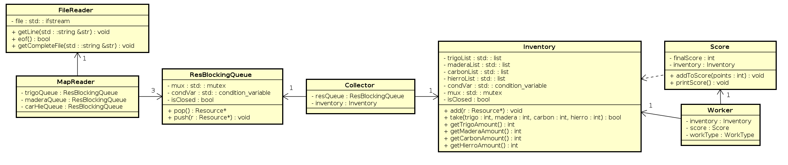
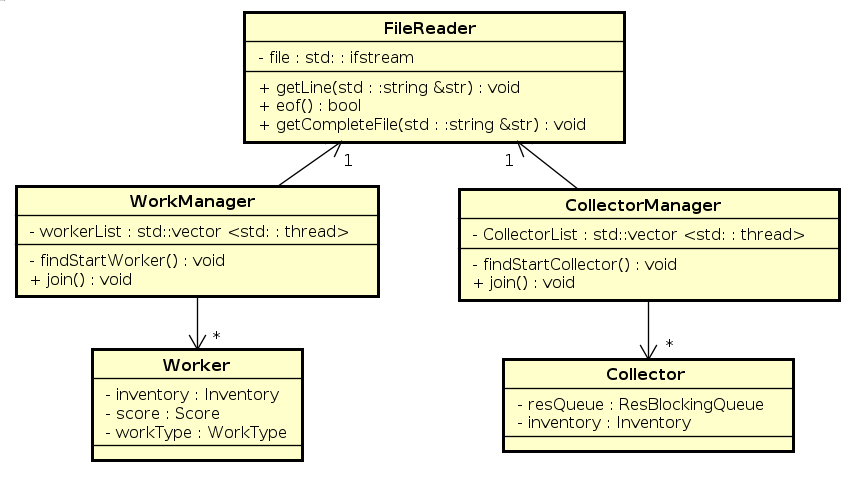

# 
 TP2 

# 
 Recolectores y Productores 

### 
 BOTTA, Guido Tomas 

### 
 Padron: 102103 

### 
 Enlace a Github: https://github.com/guidobotta/tp2-taller 

# Introducción

&nbsp;&nbsp;&nbsp;&nbsp; El presente trabajo práctico fue realizado con la finalidad de incorporar conceptos de manejo de threads.

&nbsp;&nbsp;&nbsp;&nbsp; Se desarrollo un programa en el que recolectores y productores trabajan en simultáneo a través de threads, conectados por objetos de almacenamiento bloqueantes.

# Desarrollo

## Problema de Recolectores y Productores

&nbsp;&nbsp;&nbsp;&nbsp; Se cuenta con un conjunto de trabajadores, que dividen en recolectores, que trabajan la materia prima, y productores, que transforman la materia prima en puntos de beneficio. Ambos tipos de trabajadores serán modelados como threads. Además, se cuenta con un conjunto de recursos con los que trabajarán estos trabajadores.

&nbsp;&nbsp;&nbsp;&nbsp; Además de los recursos y trabajadores, se cuenta con estructuras de almacenamiento que son las colas bloqueantes y un inventario (también bloqueante). Cada tipo de recolector tendrá una cola bloqueante a la que acceder. En cambio, habrá un único inventario compartido para todos los tipos de trabajadores.

&nbsp;&nbsp;&nbsp;&nbsp; Los recursos se dividen en cuatro tipos: **Trigo**, **Madera**, **Carbón** y **Hierro**.

&nbsp;&nbsp;&nbsp;&nbsp; Los recolectores se dividen en tres tipos:

1. **Agricultores**: recolectan trigo, proveniente de la respectiva cola bloqueante, y lo envían al inventario.
2. **Leñadores**: recolectan madera, proveniente de la respectiva cola bloqueante, y lo envían al inventario.
3. **Mineros**: recolectan hierro y carbón, proveniente de la respectiva cola bloqueante, y lo envían al inventario.

&nbsp;&nbsp;&nbsp;&nbsp; Los trabajadores se dividen en tres tipos:

1. **Cocineros**: convierten 2 unidades de trigo más 1 de carbón, obtenidas del inventario, en 5 puntos de beneficio.
2. **Carpinteros**: convierten 3 unidades de maderas más 1 de hierro, obtenidas del inventario, en 2 puntos de beneficio.
3. **Armeros**: convierten 2 unidades de carbón más 2 de hierro, obtenidas del inventario, en 3 puntos de beneficio.

&nbsp;&nbsp;&nbsp;&nbsp; Los trabajadores, al recibir los materiales que necesitan, dormirán para simular trabajo. Por parte de los recolectores, dormirán 50ms. Mientras que los productores dormirán 60ms.

&nbsp;&nbsp;&nbsp;&nbsp; Para la ejecución del programa, se requieren dos archivos:

- Uno con la información de la cantidad de trabajadores, con el siguiente formato:

~~~
Agricultores=x
Leniadores=x
Mineros=x
Cocineros=x
Carpinteros=x
Armeros=x
~~~

&nbsp;&nbsp;&nbsp;&nbsp;&nbsp;&nbsp;&nbsp;&nbsp; Donde x puede ser cualquier número entero positivo. No importa el orden de los trabajadores, pero deben estar todos especificados.

- Otro con la información del mapa, que contiene los recursos que serán trabajados, con el siguiente formato:

~~~
TTTMMCCHHHC
TTTMMMCCCMM
MMMMMMTTTTC
~~~

&nbsp;&nbsp;&nbsp;&nbsp;&nbsp;&nbsp;&nbsp;&nbsp; Donde T representa Trigo, M representa Madera, C representa Carbón y H representa Hierro. Además, se deben tener en cuenta las siguientes aclaraciones:

- El mapa puede estar vacío.
- El mapa puede tener todos los recursos y saltos de lineas que se deseen.
- No puede haber otra cosa que `'T'`, `'M'`, `'C'`, `'H'` y `'\n'`.

&nbsp;&nbsp;&nbsp;&nbsp; El hilo principal es el encargado de spawnear el resto de los hilos, leer el archivo con el contenido del mapa, y repartir los recursos en las colas bloqueantes. Luego, este hilo se encarga de finalizar los procesos e imprimir las estadísticas finales, que tienen el siguiente formato:

~~~
Recursos restantes:
  - Trigo: x
  - Madera: x
  - Carbon: x
  - Hierro: x

Puntos de Beneficio acumulados: x
~~~

&nbsp;&nbsp;&nbsp;&nbsp; Donde x es el número entero que representa la cantidad de recursos restantes, en el caso de los recursos, o los puntos de beneficios acumulados al finalizar el programa.

&nbsp;&nbsp;&nbsp;&nbsp; La siguiente imagen representa la dependencia de cada objeto.

&nbsp;&nbsp;&nbsp;&nbsp; Por último, el formato para la ejecución del programa es el siguiente:

~~~
./tp trabajadores.txt mapa.txt
~~~

## Diseño e implementación

&nbsp;&nbsp;&nbsp;&nbsp; Para la solución de el problema planteado, se definieron diferentes clases que se pueden dividir por sectores.

- Sector 1: aquí se encuentran las clases que no están asociadas a un hilo y que no realizan acciones por su cuenta. Funcionan como almacenamiento temporal de información. Son las siguientes:

    1. **ResBlockingQueue**: Implementa la `cola bloqueante` que hace de intermediara entre el hilo que realiza el mapeo y los recolectores. Se instancian 3 objetos de esta clase, uno para cada tipo de recolector.
    2. **Inventory**: Implementa el `inventario bloqueante` que sirve de intermediario entre los recolectores y los productores. Se instancia un único objeto inventario.
    3. **Score**: Implementa el resultado final. Se encarga de ir almacenando los `puntos de beneficio` que le envían los trabajadores y, al finalizar el programa, imprime estos puntos y los recursos restantes del inventario. Se instancia un único objeto de esta clase.

- Sector 2: aquí se encuentran las clases que se asocian a algún hilo y son las encargadas de la ejecución principal del programa.

    1. **Collector**: Implementa al `recolector`, que le pide a la `cola bloqueante` el recurso que necesita y lo envía al `inventario`.
    2. **Worker**: Implementa al `productor`, que le pide al `inventario` los recursos que necesita y los convierten en puntos de beneficios, los cuales van al `Score`.
    3. **MapReader**: Implementa al `lector del mapa`. Este lee el archivo de texto `mapa.txt`, crea los `recursos` y los envía a las `colas bloqueantes`.

- Sector 3: aquí se encuentran las clases que se encargas de controlar a los trabajadores.

    1. **CollectorManager**: Implementa una clase que se encarga de crear, inicializar y destruir a los objetos de tipo `Collector`.
    2. **WorkManager**: Implementa una clase que se encarga de crear, inicializar y destruir a los objetos de tipo `Worker`.

- Sector 4: aquí se encuentran las otras clases, que sirven para completar el desarrollo del programa.

    1. **Resource**: Implementa la clase `Recurso`.
    2. **FileReader**: Implementa una clase que sirve de lector de texto. Se creó esta clase para no permitir que queden archivos abiertos.

&nbsp;&nbsp;&nbsp;&nbsp; A continuación se muestran distintos diagramas para detallar la implementación.

&nbsp;&nbsp;&nbsp;&nbsp; Este diagrama de clases muestra la implementación de las clases encargadas del flujo principal del programa. El `MapReader`, que cuenta con un `FileReader`, se encarga de leer el mapa y enviar `Recursos` a cada una de las 3 `ResBlockingQueue's` que tiene asignada. Luego, los `Collector's` se encargan de retirar de su correspondiente `ResBlockingQueue` un `Recurso`, para luego enviarlo al `Inventory`. Del `Inventory` toman los recursos, una vez que están disponibles, los distintos `Worker's`. Estos se encargan de convertir los `Recursos` en puntos de beneficios, actualizando al `finalScore` del objeto de clase `Score`.

&nbsp;&nbsp;&nbsp;&nbsp; El anterior diagrama de clases muestra la conexión entre las clases `Manager` y las `Trabajadoras`. Las clase `Manager` son las encargadas de obtener del archivo, leido por un `FileReader`, las cantidades de cada `Recolector`, en el caso de `CollectorManager`, y de cada `Trabajador`, del lado de `WorkManager`. Una vez obtenidas las cantidades, crean entre 0 y n (n un numero natural) de cada clase `trajadora`. Una vez finalizada la ejecución de los `trabajadores`, los `managers` se encargan de asegurarse que no haya errores en la ejecución, realizando un `join` sobre cada hilo existente.

## Dificultades en el Desarrollo

&nbsp;&nbsp;&nbsp;&nbsp; A continuación se mencionaran ciertos escenarios que presentaron alguna dificultad en el desarrollo:

1. Uno de los problemas que se presentó fue el de la complejidad del lenguaje al desarrollar POO. Si bien C++ es un lenguaje con orientación a objetos, la programación *"puramente"* orientada a objetos se dificulta en ciertos casos, a diferencia de la programación con Java. Por ejemplo, es muy complicado hacer un `Double Dispatch` sin que presente complicaciones.

2. Otro de los mayores problemas fue el de debuggear threads. Al ejecutar un debugger y correrlo con normalidad como si se tratase cualquier programa sin threads, se presenta la complicación del switch entre threads que realiza el procesador en momentos inpredecibles. Si bien algunos editores de texto como `Visual Studio Code` presentan algunas herramientas para tratar con estos, no deja de ser una tarea difícil.

# Conclusiones

&nbsp;&nbsp;&nbsp;&nbsp; Trabajar con hilos puede ser muy complicado y dificil a la hora de debuggear. Aún así, son necesarios a la hora de crear un programa de gran escala, ya que la posibilidad de ejecutar diferentes tareas en paralelo puede ser muy beneficioso sobre el rendimiento. Esto hay que tratarlo con cuidado, ya que si se abusa sin sentido de estos recursos, puede llegar a bajar el rendimiento del programa.

&nbsp;&nbsp;&nbsp;&nbsp; En este trabajo puede no ser tan notoria la diferencia de rendimiento, aunque el hecho de que los trabajadores tengan que dormir para simular trabajo, hace que otros hilos puedan aprovechar y seguir trabajando. Se realizó el experimento de hacer un mapa con muchos recursos y trabajar distintas cantidades de trabajadores. Pero si bien se nota una diferencia, no creo que sea el mejor de los ejemplos para dar en cuanto a rendimiento.

# Apéndice

## Correcciones en el Trabajo

&nbsp;&nbsp;&nbsp;&nbsp; Se realizaron las siguientes modificaciones:

- **main** y **MainController**: Se desarrolló una clase MainController para seguir el concepto RAII. Se dividió la ejecución del programa en tres etapas:
  1. La construcción de los objetos a utilizar, que se construyen dentro del constructor de la clase `MainController`.
  2. La ejecución del programa, que se ejecuta dentro de una función `run` de la clase `MainController`. En esta etapa se ejecutan las instancias de las clases `WorkManager` y `CollectorManager` donde se hechan a correr los hilos de las clases `Worker` y `Collector`.
  3. La finalización del programa, que se ejecuta dentro del destructor de la clase `MainController`. En esta etapa se cierran las instancias de cada objeto y se llama a `join` para los hilos ejecutados.

- **Hilo de MapReader**: Se eliminó el hilo del `MapReader` y se utilizó el hilo principal para realizar esta tarea ya que el main no hacía nada entre la instanciación de este hilo y la finalización de su ejecución.

- **Score** e **Inventory**: Se creo una función `printResources` en la clase `Inventory` para quitar los `getters` de la clase `Inventory` y dividir así la impresión de los recursos restantes del puntaje final. Además, en la clase `Score` se agregó un `mutex` para evitar una race condition en el método `addToScore`. Por último, en el `Inventory` se cambió la implementación y se reemplazaron los vectores que almacenaban los recursos por sumadores, que llevan la cuenta de cuántos recursos de cada tipo llegaron.

- **Worker**, **RealWorker**, **Collector** y **RealCollector**: A las clases trabajadoras se las hizo heredar de una clase `Thread` para poder separar la instaciación del objeto de la ejecución en el `MainController`. Además, se crearon dos clases extra para encapsular la instancia en el heap de las clases trabajadores. La clase `Worker` instancia un `new RealWorker`, quien tiene toda la lógica del productor, mientras que `Collector` instancia un `new RealCollector`, quien tiene la lógica del recolector. Esto permite que pase lo que pase no se pierda memoria, ya que en el destructor de las clases `Worker` y `Collector` se hace un `delete` de la instancia. A estas clases se las hizo `CopyAssignable` para poder almacenarlas sin problema en un vector.

- **FileReader**: Se eliminó la clase `FileReader` y se utilizó simplemente un `std::ifstream`, que aplica el concepto RAII.

- **Manejo de excepciones**: Se realizó un pequeño manejo de excepciones para reemplazar el manejo de errores al estilo C. Se decidió no profundizar mucho en esto y dar por hecho que el formato de los archivos estarían correctos y que no habría problema con el manejo de memoria. Para el manejo principal de excepciones se creo una excepción `OSError`. Además, se creo una excepción `EmptyException` para avisarle a los recolectores cuándo la cola de recursos esta vacía. Se podría haber llevado el mismo concepto al inventario con los trabajadores, pero me pareció más adecuado dejar la implementación actual donde se devuelve `true` o `false` dependiendo si el inventario pudo darle los elementos al trabajador o si lo cerraron. Se tomó esta decisión ya que los trabajadores no necesitan realmente de estos recursos, en el caso de que si lo necesitaran, se podría cambiar a la implementación de lanzar una excepción cuando el inventario este cerrado y no pueda devolver más nada.

- **Cambios menores en lenguaje**: Se cambiaron algunos nombres de variables que mezclaban ingles y español a ingles. Lo único que se dejó en español son comentarios y manejos de errores.